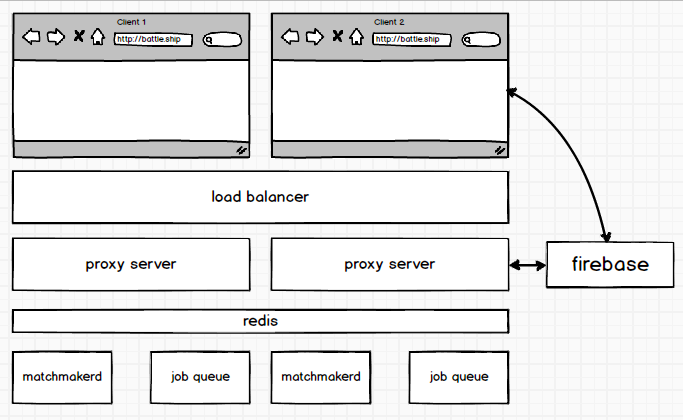

# Battleship React



The purpose of this project is to build a multiuser game of Battleship primarily on the game clients. For this reason, the architecture utilizes Firebase to manage shared game state.

However, there are two problems for the game that don't fit neatly into this paradigm:

1. How to match up interested parties for games of Battleship?
2. How to ensure that users only receive information about their own games? We don't want to hook up clients to the Firebase firehose because they'll be flooded with messages from all the games, and malicious users could use this data to ruin other users' games. This is both a performance and security concern.

An answer to both problems is a proxy server, whose job it is to pair up users for games, and to proxy game creation events between the clients and Firebase.

## Setting up the Development Environment

### Create SSL Cert for dev

```bash
make root-ca
make create-rsa.key KEY=./ssl/battleship.key
make create-csr KEY=./ssl/battleship.key CSR=./ssl/battleship.csr DN='/CN=localhost/C=US/'
make sign-cert CSR=./ssl/battleship.csr PEM=./ssl/battleship.pem
```

Import these certificates into your Trust Store.

### Running the Server's services

1) Start the game matching service

```bash
bin/matchingd start
```

2) Run workers, http server, https server, cable server, and webpack

```bash
foreman start
```

### Secure Production Deployment

In a production deployment, use Nginx to proxy `wss` connections (which clients will be obligated to use, since the whole deployment is over SSL) into the unencrypted `ws` connections used on the server.

https://github.com/nicokaiser/nginx-websocket-proxy
http://nginx.org/en/docs/http/websocket.html
